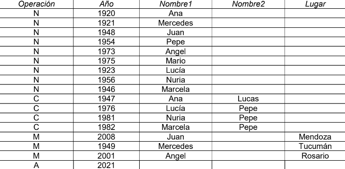

# Ejercicio 221.

El registro civil cuenta con información sobre nacimientos (‘N’), casamientos (‘C’) y
muertes (‘M’). También hay un único registro con el año actual (‘A’). Se armó la
siguiente tabla llamada Registro.

a) Hacer un listado en donde aparezca el nombre de la persona y su edad. Tener
en cuenta que:
a. Para las personas que murieron se considera el año de fallecimiento.
b. Para las que no, se considera el año actual.
Ejemplo: la edad de Ana es 101, mientras que la de Juan es 60.
b) Hacer un listado que indique si una persona es especial o no. Se considera
especial a una persona si cumple alguno de los requisitos que sigue:
a. Se casó antes de los 18 años o después de los 50.
b. Se casó 3 veces o más.
c. Su edad es mayor a 100.
Ejemplo: son especiales Lucía porque se casó a los 53 años, Ana
porque su edad es 101 y Pepe que se casó 3 veces.

c) Listar los años con registro, son aquellos en los que se registró algún evento
(nacimiento, casamiento o fallecimiento).
d) Listar los años felices, son aquellos en los que se registró algún evento, pero
no se murió nadie.

e) Listar los años de seguidilla, es una secuencia de años consecutivos en los
cuales pasó algo en todos. Tomar como mínimo, una seguidilla de 3 años. Por
ejemplo, hay una seguidilla que empieza en 1946 y dura 4 años.

# Ejercicio 222.

Se dispone de un conjunto de boletas de inscripción de alumnos a examen. Cada
boleta tiene los siguientes datos (guardados en una tabla llamada Inscripción):

- Nro de legajo (7 dígitos)
- Código de materia (6 dígitos)
- Día del examen (2 dígitos)
- Mes del examen (2 dígitos)
- Año del examen (4 dígitos)
- Apellido y Nombre (25 caracteres)

Desarrollar un programa que permita agregar más inscripciones de alumnos a los
exámenes.
