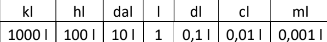

# Ejercicio 234.

Crear un programa HTML que lea 3 valores: ini, fin y nro. Y un modo para saber
¿cómo desea redondear los números? (1 – Al alza, 2 – A la baja, 3 – Normal). Debe
cumplir que nro >= que ini y <= que fin. Crear una clase llamada Generador que
reciba todos los parámetros necesarios. Realizar métodos para generar una lista de
números aleatorios decimales entre 0 y 100, con tantos números como el usuario
haya indicado. A cada uno de esos números deberá redondearlo en función de lo que
el usuario especificó en el modo. Para cada número mostrará durante el redondeo, el
número normal y después del redondeo. Finalmente deberá devolver la lista de
números redondeados.

# Ejercicio 236.

Crear una clase llamada Conversor que reciba los parámetros necesarios. En un
programa HTML ingresar un valor en cualquiera de las siguientes unidades para luego,
que la clase devuelva su equivalencia en todas las otras medidas.

